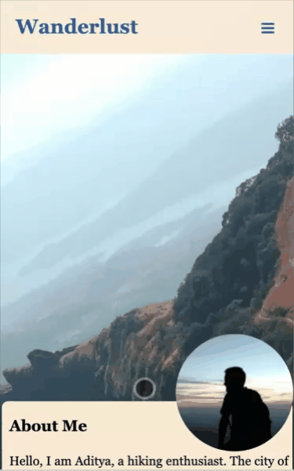

# Web Design for Everbody Capstone: Hiking portfolio

The project is a hiking portfolio created as a part of the "Web Design for Everybody" specialization Capstone project on Coursera.
The capstone project mainly focuses on building syntactically and semantically correct responsive web design targeted on multiple devices.
The web page has been developed from scratch using HTML, CSS, and JavaScript.

This portfolio is a single webpage linking to the different parts of the page through navigation links. It has three main sections namely:
1. About Section
2. Main section listing down hiking places
3. Contact section

The page validates as per w3 validator rule. It has a responsive web design having two major views(Mobile/Tablet view and Desktop view).

Project Link: http://adwde.byethost22.com/wdecapstone/capstone.html

